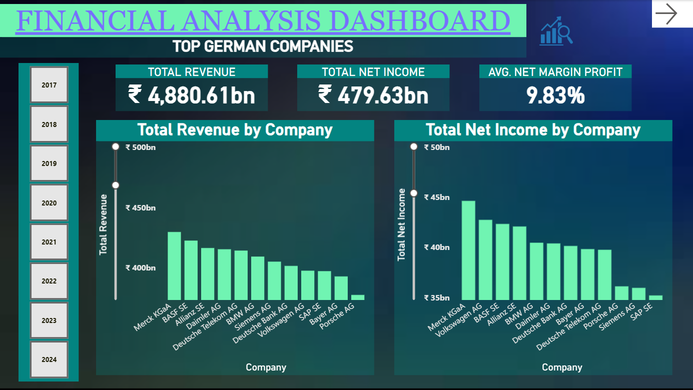
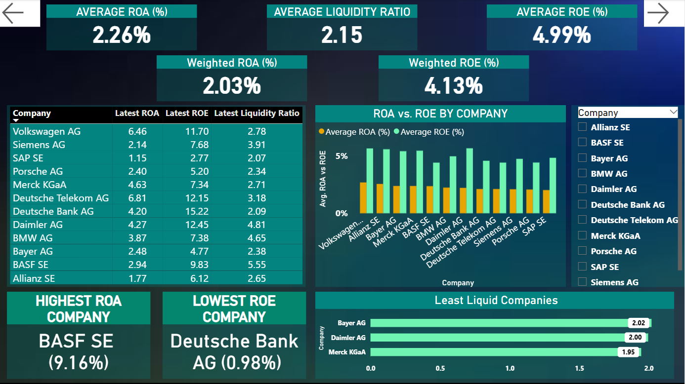
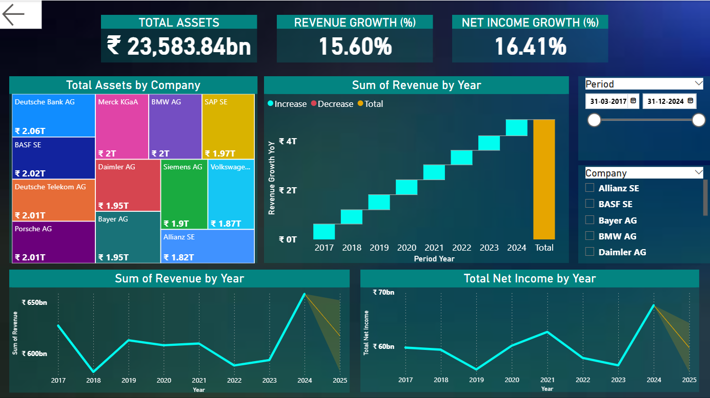

# 📊 Detailed Project Report – Power BI Financial Dashboard (Top 12 German Companies)

## 1️⃣ Project Introduction
This project presents an **interactive Power BI Financial Dashboard** analyzing the performance of **12 leading German companies** across multiple years.  
The goal was to extract actionable insights on **profitability, liquidity, growth, and forecasting** while demonstrating skills in **data modeling, DAX, financial analysis, and dashboard storytelling**.

---

## 2️⃣ Dataset Overview
| Attribute | Details |
|-----------|---------|
| **Source** | Kaggle |
| **Rows** | 385 |
| **Companies** | 12 |
| **Data Type** | Annual Financials |
| **Key Features** | Revenue, Net Income, Assets, Liabilities, Equity, ROA, ROE, Debt-to-Equity |

**Feature Engineering Performed**
- Asset-to-Equity Ratio  
- Liquidity Ratio  
- Year Extraction  
- Weighted ROA & ROE (for fair comparison)

---

## 3️⃣ Project Workflow

### 🔹 Step 1 — Data Preparation
- Imported CSV into Power BI  
- Cleaned missing values, fixed data types, and standardized formats  
- Ensured consistent currency and numeric formatting  

### 🔹 Step 2 — Data Modeling & DAX
Created measures to analyze trends, compare performance, and calculate ratios.

#### ✅ Key DAX Measures
```DAX
Revenue Growth % =
DIVIDE([Total Revenue] - [Previous Revenue], [Previous Revenue], 0)

Net Income Growth % =
DIVIDE([Total Net Income] - [Previous Net Income], [Previous Net Income], 0)

Weighted ROA =
DIVIDE(
    SUMX('Table', 'Table'[Net Income] * 'Table'[Assets]),
    SUM('Table'[Assets])
)

Weighted ROE =
DIVIDE(
    SUMX('Table', 'Table'[Net Income] * 'Table'[Equity]),
    SUM('Table'[Equity])
)
```

### 🔹 Step 3 — Dashboard Design
KPIs for quick insights

Bar & trend charts for comparing companies

Page-wise storytelling with navigation buttons

Forecasting for future performance

---

## 4️⃣ Dashboard Pages (Screenshots)
📌 Page 1 — Profit & Income Overview


📌 Page 2 — Performance Ratios Analysis


📌 Page 3 — Growth & Assets Insights


---

## 5️⃣ Key Insights
Merck KGaA leads in total revenue among the 12 companies

Average Net Margin ~9.8%, indicating solid profitability

Liquidity ratios show strong short-term financial positions

Weighted ROA/ROE highlight efficiency differences by company size

Forecasting suggests continued growth in revenue and net income

---

## 6️⃣ Tech Stack
Power BI — Data Modeling, DAX, Visualization, Forecasting

Power Query — Data Cleaning & Transformation

CSV / Excel — Raw Data Source

---

## 7️⃣ How to Use
Download the .pbit file from this repository

Open it in Power BI Desktop

Navigate through all pages using the on-report arrows

---

## 8️⃣ Repository Structure
java
Copy code
📁 Data                     → Raw dataset
📁 Images                   → Dashboard screenshots
📁 Docs                     → Detailed README (this file)
📄 Financial Analysis Dashboard.pbit
📄 README.md                → Short overview (for recruiters)
📄 LICENSE

---

## 9️⃣ Conclusion
This project demonstrates how raw financial data can be transformed into meaningful business insights using Power BI. It highlights skills in data preparation, DAX, financial analytics, and dashboard storytelling — essential for a Data Analyst / BI role.
